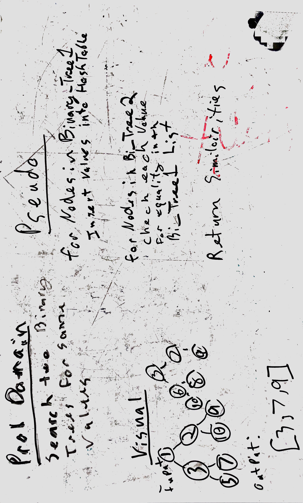

# Tree Intersection Hashtable.
Takes two binary trees and looks for similiar values!

## Challenge
Write a function called tree_intersection that takes two binary tree parameters.
return a set of values found in both trees.

## Solution
