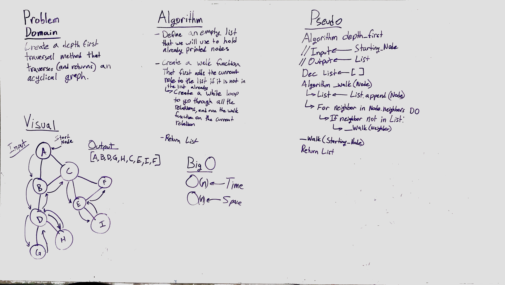

# Breadth First Graph Traversal.
This class method traverses a pre-made graph given an initial input node, using a depth first approach.

## Challenge
Create a method that uses depth first traversal on an acyclical graph given an input node that exists on the graph.

## Solution
