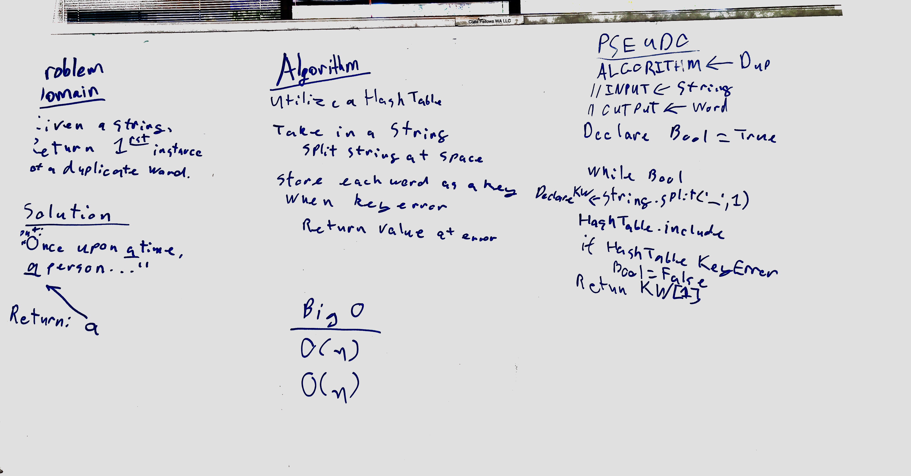

# Repeat Word Hashtable.
This function creates a key for each word in a string until a duplicate is found.

## Challenge
Write a function that accepts a lengthy string parameter.
Return the first word to occur more than once in that provided string.

## Solution
